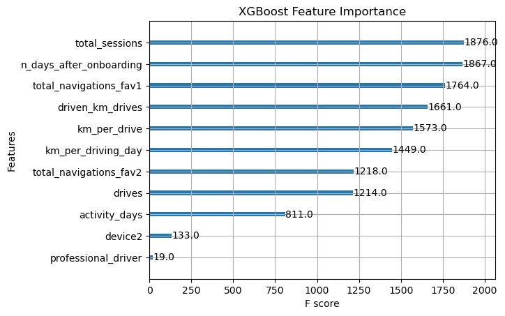

# 🛰️ Waze User Churn Prediction  
### *Google Advanced Data Analytics Capstone Project*


---

## 🚗 Project Overview
This project develops a machine learning model to predict **monthly user churn** for Waze. By identifying users at risk of uninstalling or becoming inactive, the goal is to provide Waze with actionable insights to optimize retention and product development.

---

## 🎯 Business Case
Churn is a critical performance metric for Waze. High retention indicates satisfied users and a stable community. In collaboration with **Finance** and **Operations** stakeholders, this project investigates:
- **Who** is most likely to churn?
- **Why** do users churn (key behavioral drivers)?
- **What** additional data is needed to improve predictive accuracy?

---

# 📊 Data Source
The dataset used in this analysis is hosted on Kaggle. To replicate this project:
1. Download the dataset from [Kaggle](https://www.kaggle.com/datasets/juliasuzuki/waze-dataset-to-predict-user-churn).
2. Extract the downloaded `archive.zip` file to locate **waze_dataset.csv**.
3. Place **waze_dataset.csv** inside the `/data` folder in your local repository.

---

## ⚙️ Installation & Setup
To replicate this research environment:

### Option A: Using Pip
```bash```
pip install -r requirements.txt

### Option B: Using Conda
conda env create -f environment.yml
conda activate waze_research

---

## 🛠️ Methodology — PACE Framework

### 1. Plan & Analyze
* **Exploratory Data Analysis (EDA):** Investigated relationships between drive frequency, device types, and retention behavior.
* **Data Assessment:** Identified that existing features had relatively low predictive power regarding churn, suggesting that user behavior is complex and likely influenced by factors outside the current dataset.

### 2. Construct (Feature Engineering & Modeling)
* **Feature Engineering:** Created several new predictors; notably, **6 of the top 10 features** in the final model were engineered features (e.g., `km_per_driving_day`).
* **Model Development:** Compared **Logistic Regression**, **Random Forest**, and **XGBoost**. The ensemble tree-based models (RF and XGBoost) significantly outperformed the linear model.

### 3. Execute (Evaluation & Recommendations)
* **Performance Metrics:** While the XGBoost model achieved a high accuracy (~70%), the baseline **Recall was low (~16%)**.
* **Threshold Tuning:** To explore business utility, I adjusted the decision threshold to **0.089**, which boosted **Recall to 50%** at the cost of Precision. 
* **Final Verdict:** Due to the high number of false negatives, the current model serves as a strong **baseline** but requires further data refinement before being deployed for high-stakes business decisions.

---

## 📈 Key Results & Recommendations
* **Feature Divergence:**
   * **Random Forest** identified `activity_days` (frequency of use) as the most critical driver. 
   * **XGBoost** prioritized `total_sessions` (volume of use) and `n_days_after_onboarding` (user tenure) as the most important predictors.
* **Strategic Insight:** The model identifies long-term "loyalty" and usage volume as better predictors of retention than simple daily activity.



* **Model Selection:** **XGBoost** was selected as the champion model for its superior performance on the validation and test sets.
* * **Threshold Tuning:** By shifting the decision threshold to **0.089**, I successfully prioritized **Recall (50%)** to identify at-risk users, acknowledging the research trade-off between sensitivity and precision in noisy datasets.
* **Strategic Recommendation:** I recommend **not deploying this model for automated business decisions** until more granular data is gathered (e.g., geographic locations, specific destination counts, and more detailed app interaction logs).
* **Future Work:** Focus on gathering "intent-based" data to help differentiate between casual users and those truly at risk of leaving the platform.

---

## 📦 Project Deliverables
- **[Project Proposal](./docs/Waze_Project_Proposal.pdf):** Initial scope, milestones, and stakeholder alignment.
- **[PACE Strategy Document](./docs/Waze_PACE_Strategy_Document.pdf):** Detailed project planning, methodology, and ethical assessment.
- **[Jupyter Notebook](./notebooks/Waze_Churn_Analysis.ipynb):** Full end-to-end Python analysis (Cleaning → Modeling → Threshold Tuning).
- **[Executive Summary](./docs/Waze_Executive_Summary.pdf):** High-level report on model performance and strategic recommendations.

---

## 💻 Tech Stack
- **Language:** Python
- **Libraries:** Pandas, NumPy, Matplotlib, Seaborn, Scikit-Learn, XGBoost
- **Framework:** PACE (Plan, Analyze, Construct, Execute)

---


> **Note:** The data, characters, and incidents portrayed in this project are synthetic and were created by Google for pedagogical purposes as part of the Advanced Data Analytics Certificate.
